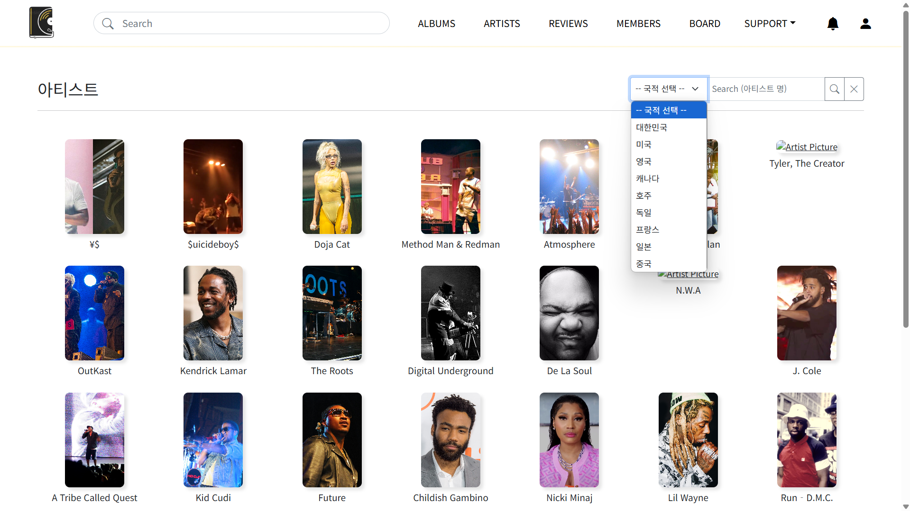
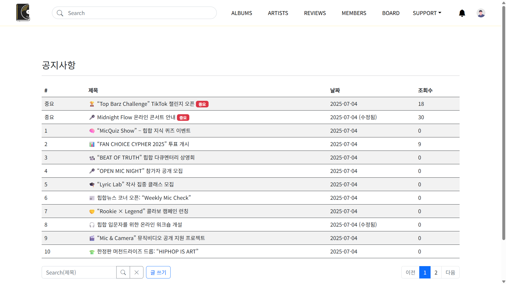

# Aelpyeong (Korean Hip-hop Album Review Platform)

## Introduction
This project is a web platform designed for Korean hip-hop enthusiasts to share reviews and ratings of hip-hop albums. It provides a community space where users can write album reviews and exchange opinions with other users.

### Key Features
- Album review creation and sharing
- User authentication and authorization
- Image upload and thumbnail generation
- Community and comment system
- Email notification service

## Tech Stack

### Backend
| Category | Technology | Version |
|----------|------------|---------|
| Language | Java | 17 |
| Framework | Spring Boot | 3.3.5 |
| Database | MySQL | 8.0.33 |
| ORM | Spring Data JPA | 3.1.5 |
| Security | Spring Security | 6.1.5 |

### Frontend & Template
| Category | Technology | Version |
|----------|------------|---------|
| Template Engine | Thymeleaf | 3.1.2 |
| Layout | Thymeleaf Layout Dialect | 3.1.0 |

### Infrastructure & Tools
| Category | Technology | Version |
|----------|------------|---------|
| Storage | AWS S3 | 2.2.6.RELEASE |
| Migration | Flyway | 9.16.3 |
| Documentation | Springfox | 3.0.0 |
| Build | Gradle | 8.4 |
| Utilities | Lombok | 1.18.30 |
| Mapping | ModelMapper | 3.1.0 |

## Data Migration

### Migration Script Structure
```sql
V2_insert_test_artists_and_albums_data.sql    # Automatically migrates test data for following models:
                                             # - Artists
                                             # - Albums
```

### Running Migrations
```bash
# Check Flyway configuration and migration status
./gradlew flywayInfo

# Run migration - This will automatically:
# 1. Create all necessary database tables
# 2. Insert initial test data for all models
# 3. Set up required relationships between models
./gradlew flywayMigrate

# Reset migration (Warning: Deletes all data)
./gradlew flywayClean
```

## System Architecture
- Based on Spring MVC architecture
- Image storage system using AWS S3
- Authentication/Authorization handling through Spring Security
- Database migration management using Flyway
- Server-side rendering with Thymeleaf

## Installation & Running

### Prerequisites
- JDK 17 or higher
- MySQL 8.0 or higher
- AWS Account (for S3 usage)

### Configuration
1. Create MySQL database
2. Configure `application.properties` file
   ```properties
   # Database
   spring.datasource.url=jdbc:mysql://localhost:3306/your_database
   spring.datasource.username=your_username
   spring.datasource.password=your_password

   # AWS
   cloud.aws.credentials.access-key=your_access_key
   cloud.aws.credentials.secret-key=your_secret_key
   cloud.aws.s3.bucket=your_bucket_name
   ```

### Running the Application
```bash
./gradlew bootRun
```

## Project Structure
```
src/
├── main/
│   ├── java/
│   │   └── io/
│   │       └── github/
│   │           └── haebin827/
│   │               ├── controller/    # MVC Controllers
│   │               ├── service/       # Business Logic
│   │               ├── repository/    # Data Access Layer
│   │               ├── domain/        # Domain Models
│   │               └── config/        # Configuration Classes
│   └── resources/
│       ├── static/                    # Static Resources
│       ├── templates/                 # Thymeleaf Templates
│       └── db/migration/             # Flyway Migration Scripts
```

## UX/UI Documentation (Updated on 07/04/2025)

### 1. Main Page (Landing Page)


### 2. Authentication & Registration
#### Login Related Pages
- **Login Page**  
  
- **Registration Page**  
  
  - With Validation:  
    
  - Registration Complete:  
    
  - Email Verification:  
    
- **ID/Password Recovery**  
  
  - Email Verification:  
    

### 3. Albums Section
#### Album Listing


> Note: "Register Artist" and "Register Album" buttons are only visible to administrators

#### Album Details
- **Without Reviews**  
  
  
- **With Reviews**  
  
  

#### Review Management
- **Write Review Page**  
  
- **Album Registration** (Admin Only)  
  

### 4. Artists Section
#### Artist Listing


> Note: "Register Artist" and "Register Album" buttons are only visible to administrators

#### Artist Management
- **Artist Registration** (Admin Only)  
  

### 5. Announcements Section
#### Announcement Listing

> Note: "Write" button is only visible to administrators

#### Announcement Management
- **View Announcement**  
  
- **Edit Announcement** (Admin Only)  
  

### 6. Support Section
#### Information Pages
- **About Page**  
  
- **Artist Request** (Logged-in Users Only)  
  
- **Feedback** (Logged-in Users Only)  
  
- **FAQ**  
  
- **Terms of Service**  
  
- **Development Log**  
  
  

### 7. User Profile
#### Profile Pages (Logged-in Users Only)

